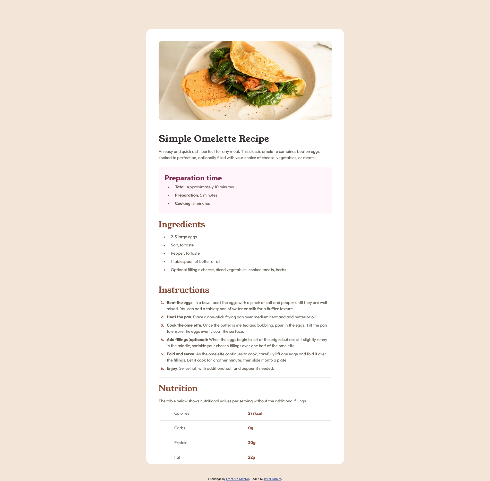

# Frontend Mentor - Recipe page solution

This is a solution to the [Recipe page challenge on Frontend Mentor](https://www.frontendmentor.io/challenges/recipe-page-KiTsR8QQKm). Frontend Mentor challenges help you improve your coding skills by building realistic projects. 

## Table of contents

- [Overview](#overview)
  - [The challenge](#the-challenge)
  - [Screenshot](#screenshot)
  - [Links](#links)
- [My process](#my-process)
  - [Built with](#built-with)
  - [What I learned](#what-i-learned)
  - [Continued development](#continued-development)
  - [Useful resources](#useful-resources)
- [Author](#author)

**Note: Delete this note and update the table of contents based on what sections you keep.**

## Overview

### Screenshot

### Links

- Solution URL: [https://github.com/javierb256/recipe-page](https://your-solution-url.comhttps://github.com/javierb256/recipe-page)
- Live Site URL: [https://javierb256.github.io/recipe-page/](https://javierb256.github.io/recipe-page/)

## My process

### Built with

- Semantic HTML5 markup
- CSS custom properties
- Bootstrap
- Mobile-first workflow

### What I learned

For this project I wanted to approach it with a mobile-first workflow so I started from a mobile view and worked up towards desktops. This was an intersting approach given that I was using bootstrap which made the initial design and page content on mobile very easy to build. As I worked upward I found that I had some issues with bootstraps default stylings which I had to overwrite in order to get my website to look as close as possible with the challenge specifications.

### Continued development

Use this section to outline areas that you want to continue focusing on in future projects. These could be concepts you're still not completely comfortable with or techniques you found useful that you want to refine and perfect.

For developments in the future I would like to try out more mobile first workflows in order to get a better grasp on how to then work upwards. I would also like to get more familiar with Bootstrap since I am still not very comfortable using it but with more practice I will gain a better grasp of it.

### Useful resources

- [Bootstrap](https://getbootstrap.com/) - Bootstrap documentation

## Author

- Website - [https://javierbarrera.dev/](https://javierbarrera.dev/)
- Frontend Mentor - [https://www.frontendmentor.io/profile/javierb256](https://www.frontendmentor.io/profile/javierb256)

